**Traws Eryri, May 2024**

When Cycling UK launched a new Traws Eryri (Trans Snowdonia) route in August 2023, I was excited enough to put out a throw-away post to the club saying,“this looks cool”. Dan picked up the baton and ran with it, doing all the groundwork to make the trip a reality for a hopefully sunny May in 2024. We opted to break the route into a relaxed 4 days, staying in basic accommodation rather than camping, to keep it light and simple.

By the time May bank holiday weekend rolled around, there was a group of four of us eager and able to get out there: Dan, Matt, Julian and me (Michelle). A 9:30am rollout from Machynlleth (“Mach”) meant setting off from the forest around 6am, making our longest day even longer.

*Day 1 - Machynlleth to Dolgellau via Dyfi forest and Barmouth beach - 79.11 km, 1427 m*

The theme of the day in my mind was “ramps”. Wales seems to specialise in gradients, or rather, not doing anything to moderate gradients. And at the end of a gradient, they love nothing more than a final little kicker ramp. But the weather Gods were smiling on us: the day was warm, dry and bright. Soon after setting off from Mach, we reached the Dyfi Forest trails near Corris. We had planned to take in 6 sections of the ClimachX trail, but Julian spotted that we could avoid having to re-ascend to get back on our route by cutting out a couple of the trails, so that happened. The climb from the carpark was a wake up call and a taste of things to come. The first trail, Sidewinder, was a fun, slightly rocky and narrowish ledge traversing the side of the hill. Then va-va-voom, the artist, more nasty climbing to where’s my ball? And a long descent to get us back onto the route for, you guessed it, immediately more climbing.

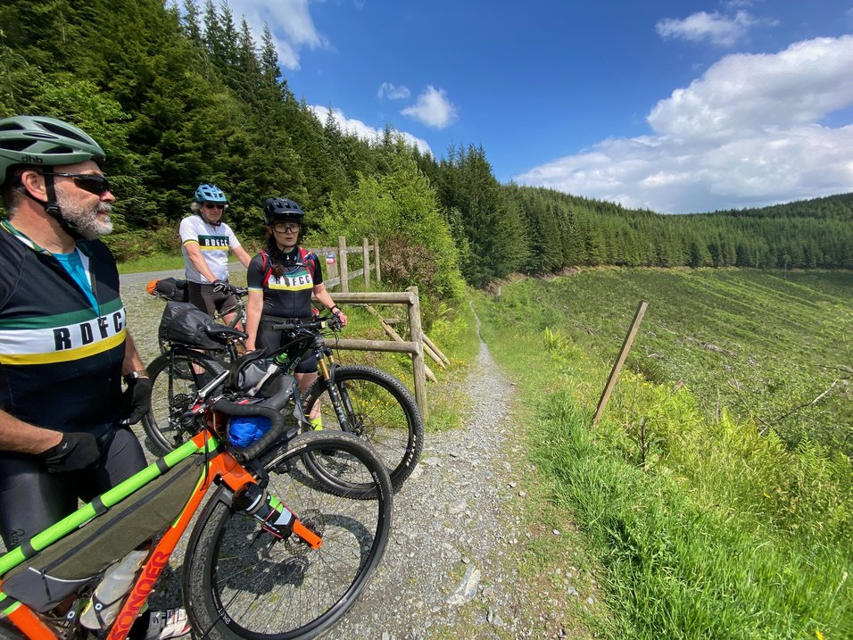

The views of the wall-like hill rising above Llyn Mwyngil (Tal-y-llyn Lake -  a large glacial ribbon lake) were a highlight. Then the 7+ exposed km of the Fford ddu climb were probably the toughest of the day. That said, we met a man who was doing reps of it and he seemed quite cheerful. After a brief descent through a small isolated wood, we emerged to spectacular views over Barmouth, the Mawddach estuary and beyond to the mid-Eryri mountains. What goes up must come down, and our climb of the fford ddu road was rewarded with around 8km of descent with fantastic views all the way down. 

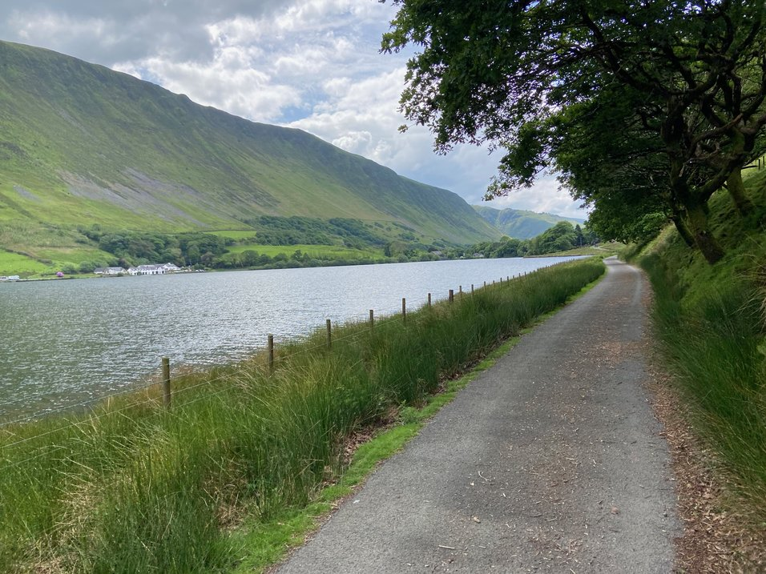
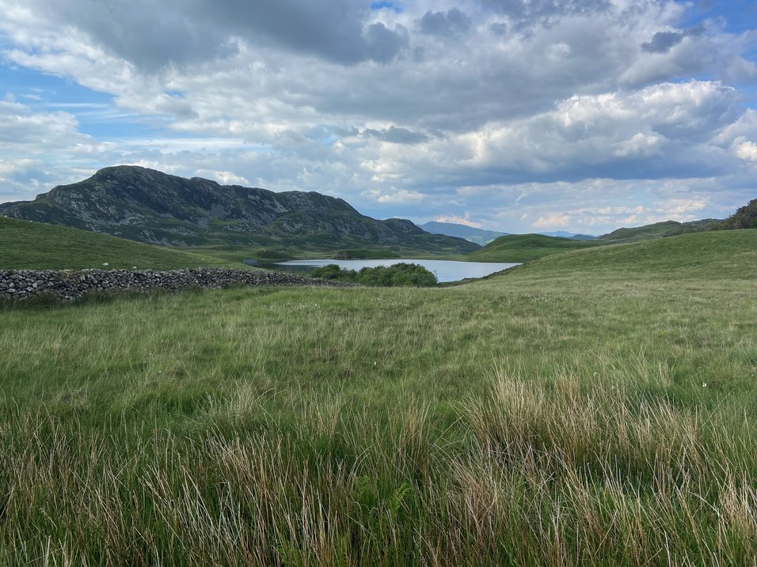

Here we took a detour to see Barmouth, a fundamentally impressive town in an exceptionally beautiful coastal setting, dressed in the tacky garments that go hand in hand with seaside tourism in the UK. My West Australian eyes were on stalks as we rode past the glorious white sand beach! Sadly no time for photos as we were on the hunt for refreshments, so this stock wikimedia commons photo will have to do.

All that was left was a long, easy pedal up the estuary path into Dolgellau, spotting lots of wildfowl and, surprisingly, cows in the salt marshes.

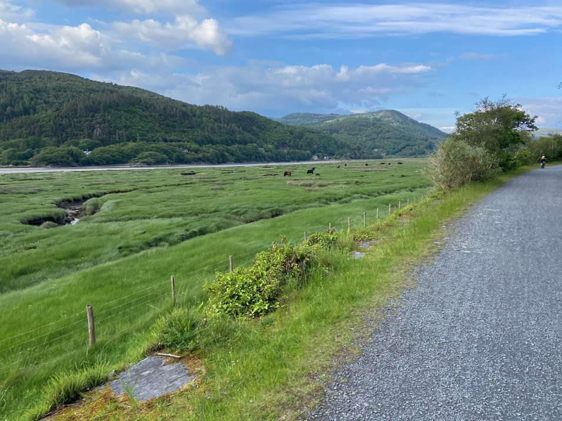

Great accommodation at Plas Isa guest house: comfortable, clean, quiet, great hosts, nice breakfast and kitted out well for cyclists.

*Day 2 - Dolgellau to Trawsfynydd via Coed-y-Brenin - 55 km, 1,360 m*

With very heavy rain in the morning turning to drizzle, 30 minutes of riding got us back to cross the Afon Mawddach via its Grade II listed wooden bridge (toll of 30p each). Then it was time for the first long climb of the day, starting out with nasty gradients that were more or less tough for 6 kms or so. Rain persisted for the first half of the day, but never too heavy. We hit Coed-y-brenin and tried out some of the “new” gravel trails (newly branded fire roads), had a refreshingly good lunch at the visitors’ centre, feeding seeds to the tame birds that hang out there, then tried out a handful of the trail centre trails - a couple of very nice blues, one reminiscent of the Verderers’, and a surprisingly techy red: rocky, narrow ups and downs.

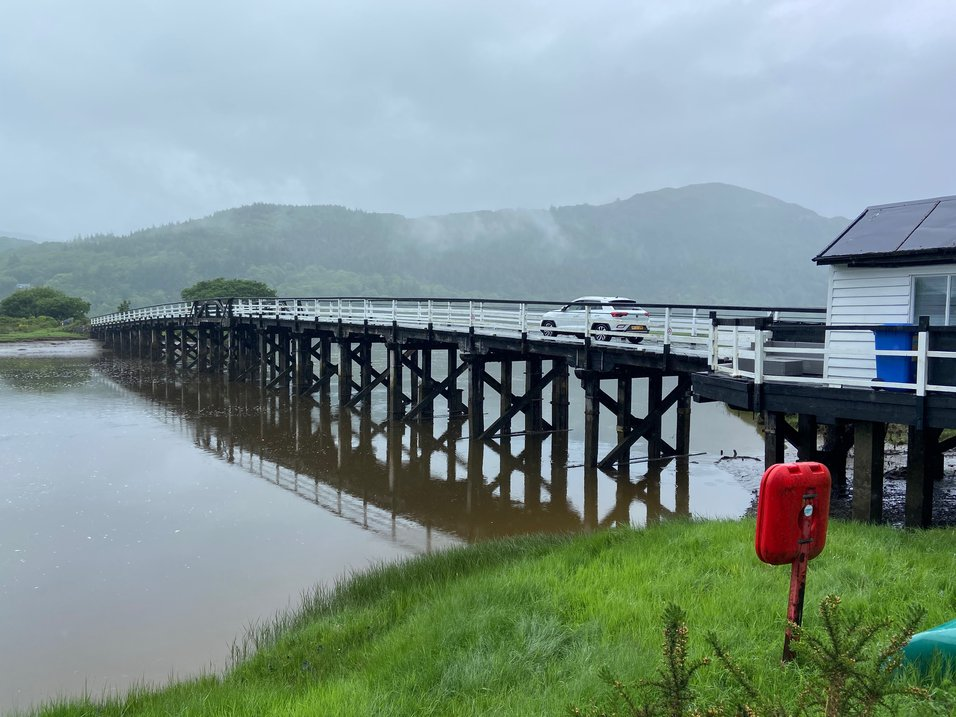

Sarn Helen. Oh. Hardship. This Roman Road, with its tough, rocky, technical climbs was in many parts unrideable. Sapping. By this time the weather was hot and sunny again. And despite Dan’s promise of “no puddles,” to Matt’s dismay, there were a great many puddles and lots of walking around deeper ones. Let’s be honest and call them lakes. Great views though. And amazing scenes as we watched three 4WDs unsuccessfully willing their engines up an impossibly steep hillside. If we’d stayed to watch a little longer maybe we’d finally see “reddy”, or even “little yellow” flip right over? 

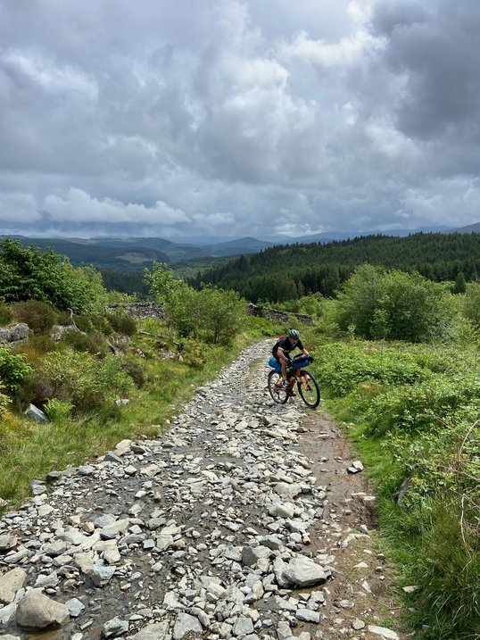

A fast roll into Trawsfynydd (“Traws”), drop some of our stuff at the night’s accommodation - The Cross Foxes - before heading out for the loop of the nearby lake (Llyn Trawsfynydd) - part of the published route. Incredible large scale engineering on display at the Argae Newydd Maentwrog Dam at the Nuclear power plant - renewed in 1992. The plant itself is in the process of being decommissioned, but this process is expected to take until the end of this century! The plant looms into the sky next to the lake, from a distance looking like a mediaeval castle. The view up close looks far less romantic: more like a pair of derelict Soviet apartment blocks. Though it was a loop of a lake, it wasn’t all flat. There were at times some fast and fun trails built into the paths around the lake and ever changing scenery. The sound of cuckoos calling.

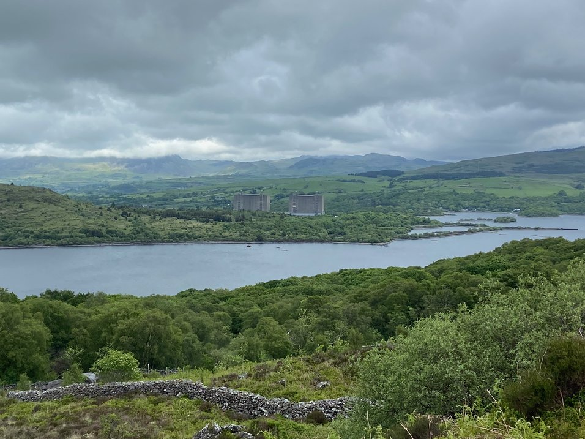

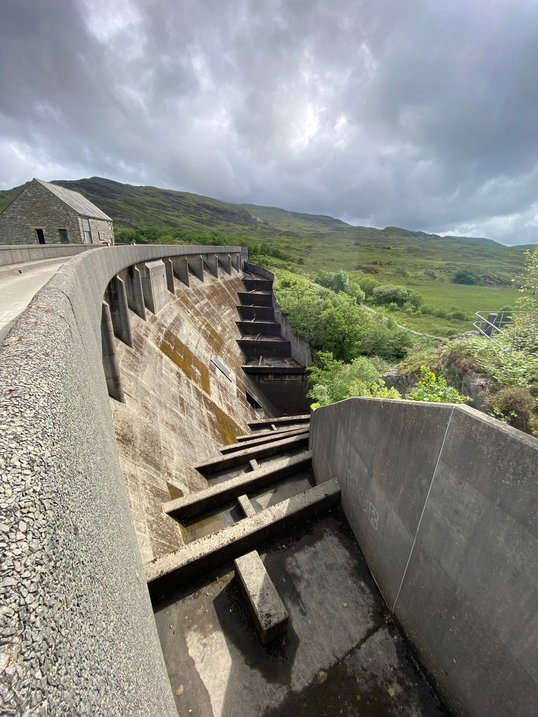

 
The Cross Foxes was pretty comfortable and had a restaurant and pub downstairs. Great bike room in development. Dismal food for non-meat eaters, distressingly bad karaoke until late.

*Day 3 - Trawsfynydd to Betws-y-coed, no extras, 47.5 km, 1164 m*

Our finely-woven plans began to fray a little at the edges, as two of our group reluctantly had to abandon before the day began, leaving just me and Dan.

A late start meant we missed the torrential downpour, but it was still mucky and wet early in the day, with brilliant sunshine for the rest of the day. After an early slog through slippery mud ascents and waterlogged fields, we hit our first sight-seeing of the day: the scheduled monument, Castell Tomen y Mur. This is a Roman fort (with a later Norman castle) built to protect the Sarn Helen road. They needn’t have bothered. The hardship of following the Sarn Helen road is enough protection. That said, today’s section of Sarn Helen had just the right amount of tech to be challenging but still rideable and I left that segment wanting more.

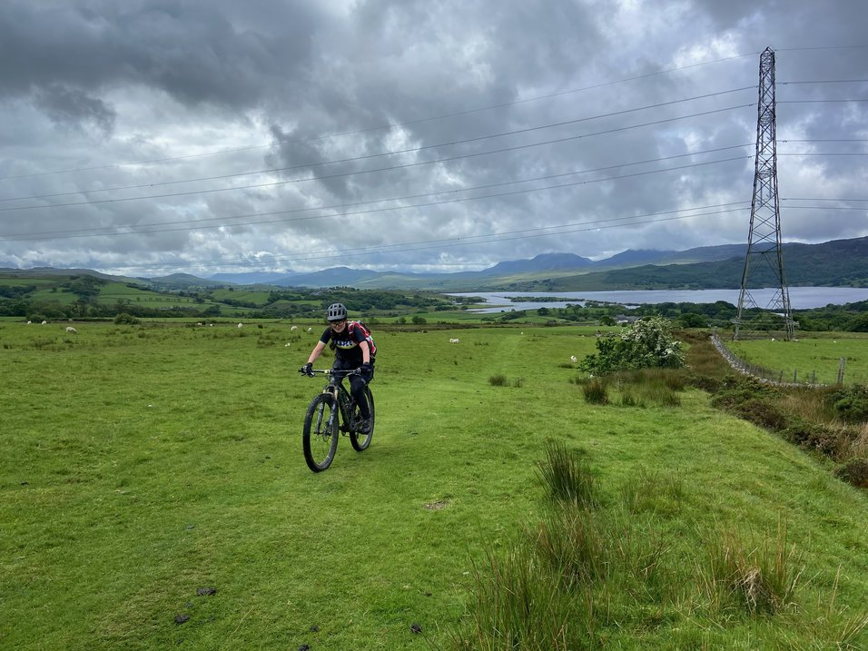

A long road section running parallel to the raging Afon Machno chewed through some miles, providing spectacular scenery and speeding us up, before turning off onto a gorgeous rolling off-road route around Penmachno with absolutely beautiful scenery and a national trust property (Tŷ Mawr Wybrnant) nestled in a valley, dive-bombing swifts and some very content pigs. After a stretch on the road, we paused to cross, but looked up and saw Plas Penaeldroch Manor house towering above us, advertising coffee. Rude not to, right? Very strong coffee ensued (making up for the poor offering at the Cross Foxes at breakfast) and some play time with a mad collie, then off again onto our next, enjoyable, section of Sarn Helen, then the woods and fire roads above Betws-y-coed (“Betws”). We had planned to do some extra trails around Betws, but on rounding a fast downhill corner we found a rider down on the ground. He’d come off and thought he broke his shoulder. Visiting from the US, his brakes were set up opposite to what he was used to. We got some painkillers and chocolate into him, got him warm, arranged for him to be picked up and waited with him. We still had time, but we saw Bill as an omen and called it a day while we were ahead.

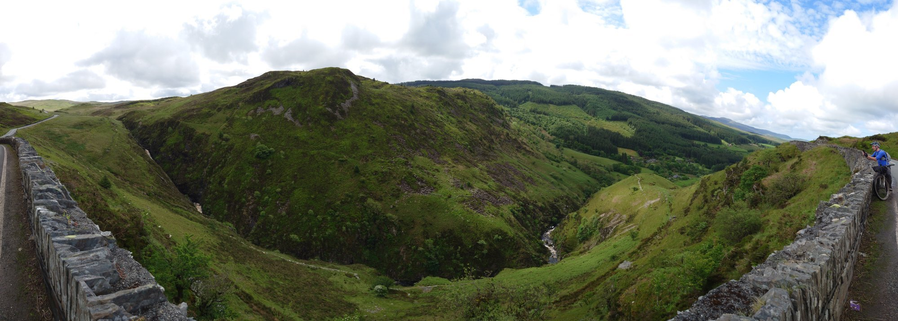

The Vagabond bunkhouse was very basic. Many other, and likely better, accommodation options available in Betws and not far beyond.

*Day 4 - Betws-y-coed to Conwy, no extras, coastal detour to avoid “bog of doom”, 66.5 km, 960 m*

This day’s optional trail - the Crafnant Descent - would have started the day, but only in fine weather, as it’s a few km of exposed descent. The weather was very wet and windy, so we dropped it. Further unravelling took the form of Dan’s Garmin refusing to power back on. No proper breakfast, no proper coffee. Then, 10km into our day’s ride, discovering Dan’s phone had escaped its pocket somewhere on the trail. Despite backtracking, it couldn’t be found. Sad faces. But it’s ok! We had planned well, and we still had my phone, garmin, a backup garmin watch and a backup-backup paper guide in case everything went awry. Onwards! We found a nice place for coffee in Capel Curig that is also a B&B (Tyn-e-coed) and would have been a fine alternative to the Vagabond. The first 26km of the day were pretty much one long steady-ish climb, through beautiful but mist-shrouded scenery. Between Capel Curig and Bethesda was probably the most spectacular scenery of the entire trip: enormous peaks and valleys, a gorge and gigantic waterfalls. The abandoned slate quarry was an amazing sight, but managed to resist the strong temptation to strap a block of free slate onto the tailfin.

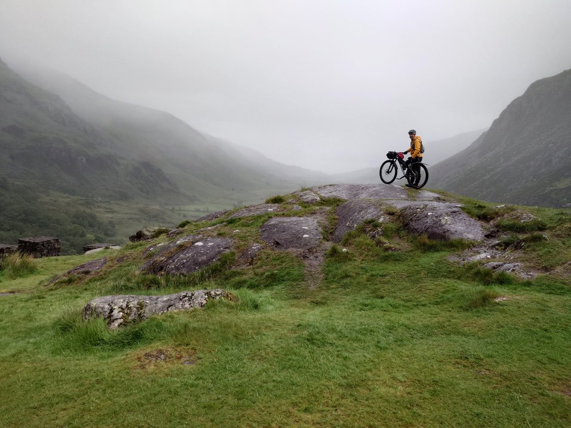

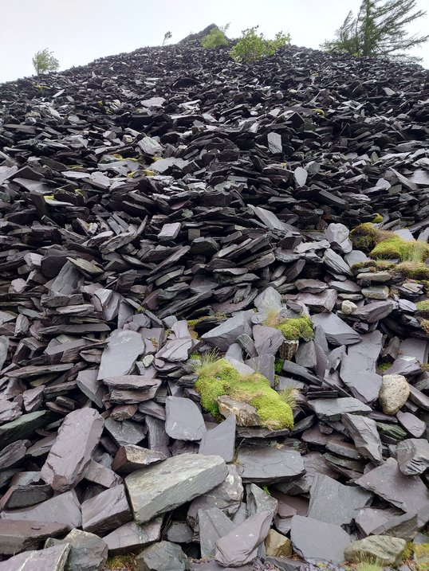

Lunch at Bethesda was a welcome relief from the rain, and we changed into dry gloves and dry socks too for me (wishing I had one extra pair of shorts). From here, the sun came out again, and winding, narrow, dry stone walled country lanes finally revealed a view of the sea - Menai straits and Ynys Môn! We had opted to avoid the “bog of doom” which also meant not having to climb up to it. Some impressive cycling infrastructure that took us over a raised bridge threaded overhead in the middle of the dual carriageway, one final leg sapping climb then down to the coastal cycle path for a fast ride to the smallest house in Britain and end of the route in Conwy.

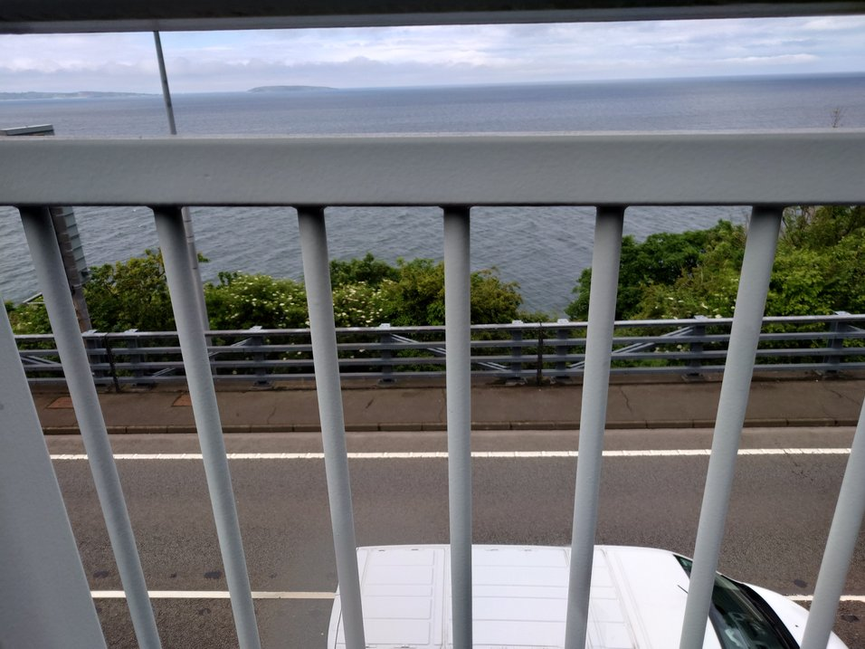

Many thanks are due to Dan for herding these cats. And hats off to Cycling UK - they knocked it out of the park with this one. Same again next week?
